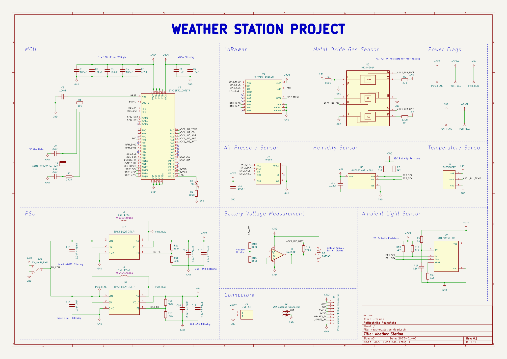
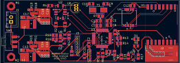
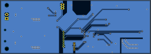
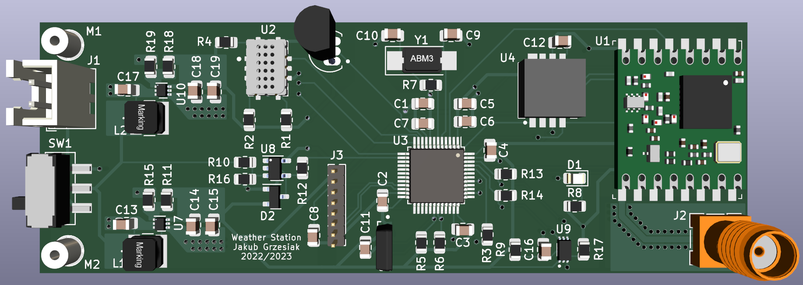
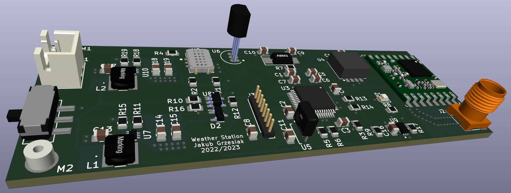
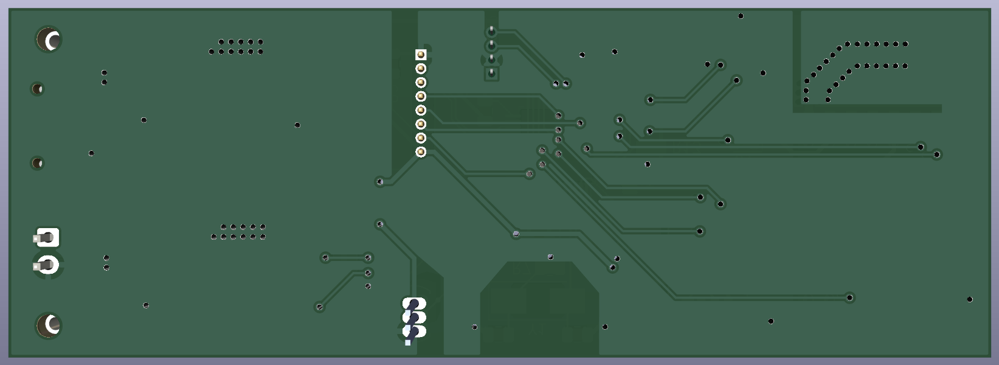

# Weather-station
PCB project of a remote weather station.

## General information:
The device can be battery powered (max. input voltage 5.5V).

Data from the sensors are transmitted via I2C, SPI and Analog.

Project includes: schematics, PCB, BOM, datasheets, 3D models, Gerber and drill files.

PCB dimensions: 90mm x 32mm.

## Modules:
- STM32 MCU
- 5 weather conditions sensors
- LoraWAN module for wireless communication
- Battery voltage measurement unit 
- Power supply unit (includes boost converters TPS61023DRLR)

## Main Components:
- MCU - STM32F301C8T6TR
- LoraWAN - RFM95W-868S2R
- Metal Oxide Gas Sensor - MICS-6814
- Air Pressure Sensor - KP254
- Humidity Sensor - HIH6020-021-001
- Temperature Sensor - TMP36GT9Z
- Ambient Light Sensor - BH1750FVI-TR
- Boost Converter - TPS61023DRLR

## Schematics:

## PCB:

## 3D Views:

---
Project designed in KiCAD 6.0.

Author: Jakub Grzesiak
