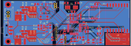

# Weather-station
The PCB project of an external, autonomous weather station including a battery-powered system for monitoring atmospheric conditions using 5 weather sensors. 
The STM32 microcontroller was used to operate the sensors, while a LoRaWAN radio communication module was utilized for long-range, wireless data transmission.

## General information:

The PCB project was implemented on a FR-4 laminate with a thickness of 1.5mm and dimensions of 90x32mm, consisting of two signal layers. 

The copper tracks have a thickness of 35μm. 

The board includes a 2-pin JST-XH power connector, a programmer/debugger 8-pin connector for the microcontroller, and an SMA antenna connector. 

To obtain +5V and +3.3V voltages, two voltage converters were used (with a maximum supply voltage of +5.5V). 

The maximum current consumption calculated for the entire circuit is approximately 500mA. 

The device can be battery powered (max. input voltage 5.5V).

Data from the sensors are transmitted via I2C, SPI and Analog.

Project includes: schematics, PCB, BOM, datasheets, 3D view, Gerber and drill files.

## Modules:
- STM32 MCU
- 5 weather conditions sensors
- LoraWAN module for wireless communication
- Battery voltage measurement unit 
- Power supply unit (includes boost converters TPS61023DRLR)

## Main Components:
- MCU - STM32F301C8T6TR
- LoraWAN - RFM95W-868S2R
- Metal Oxide Gas Sensor - MICS-6814
- Air Pressure Sensor - KP254
- Humidity Sensor - HIH6020-021-001
- Temperature Sensor - TMP36GT9Z
- Ambient Light Sensor - BH1750FVI-TR
- Boost Converter - TPS61023DRLR

## Schematics:

## PCB:

## 3D Views:

---
Project designed in KiCAD 6.0.

Author: Jakub Grzesiak
